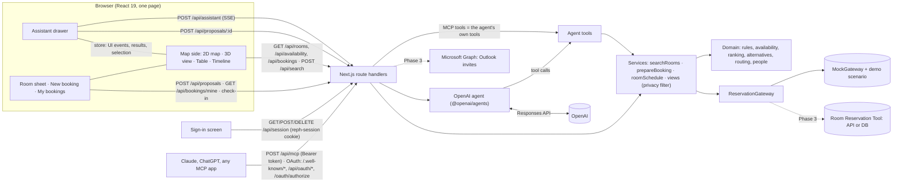

# 01 · Overview

## Problem
Booking a room today means opening the Room Reservation Tool, picking a building and a room from a list, reading a calendar by hand, and filling in a form. People can't quickly see which rooms are free, which size fits, or where a room is. When everything is taken, they don't know who has the room or whether it will be used. Approved bookings arrive as an .ics file that must be forwarded to attendees by hand, and unused rooms stay blocked.

## Goal
A friendly way into the existing tool. People say what they need in plain words. The assistant finds the best-fit room, handles conflicts politely, books it after they confirm, and shows the way there on a live floor map.

The target process (from the "AI Powered Room Reservation Assistant" flow):
1. Enter requirements: type of agenda, location, date, start, end, attendees.
2. AI search and filter.
3. Check availability, then one of three flows:
   - **A · Rooms found** → ranked recommendations with details → select → book.
   - **B · Partly free** → partial match and current owner → contact the owner (Teams or email) → internal arrangement.
   - **C · Nothing free** → booked rooms and their owners → contact an owner or change the request.
4. Booking confirmation with building, floor, capacity, map and directions.

## Success measures for the pilot
| Measure | Target |
|---|---|
| Median time from first message to confirmed booking | under 60 seconds |
| Share of pilot-floor bookings made through the assistant | 40% by week 4 |
| Double bookings | 0 |
| Right-sized bookings (room capacity at most 2× participants) | 80% |
| Agent eval pass rate (evals/phrases.json) | 90% or better before any release |
| Unused bookings released automatically (Phase 3) | tracked weekly, trending down |

## Users
| User | Needs |
|---|---|
| **Requester** – any employee, any shift | Find a fitting room fast, even on the night shift; no form-filling; see who has a room and when; sign in once (demo accounts until company sign-in); or ask from the AI app they already use (Claude, ChatGPT, … over MCP) |
| **Booking owner** – holds a room someone else wants | A polite, easy-to-accept request; a room offered in return |
| **Admin** – Corporate Services | Rules followed, fewer wasted rooms, visitor offices kept manual. In the app: `/admin` to approve, change, swap and cancel bookings, message the people who booked, see reports and the log, manage accounts and room details, with its own assistant (02 F29–F33) |
| **New joiner or visitor host** | Directions to the room |

## Scope by phase
| Phase | Delivers | Real bookings? |
|---|---|---|
| **1** | Assistant (incl. questions about the guidelines), confirm flow, 2D map and 3D view drawn from the guidelines' appendix layouts (every room, desk and chair), timeline, my bookings, room sheet, New booking form, table view (the tool's reservation list, pagination, details), assistant drawer, the tool's form fields incl. recurrence and hardware (read-only ones in Booking details), demo sign-in (three accounts; the signed-in person is the Name of Requestor), one room per person at a time, who-has-the-room answers (`room_schedule`) and grouped suggestions in the assistant, an MCP server with OAuth 2.1 so Claude, ChatGPT or any MCP app can use the same tools (bookings only through a confirm link), scope guardrail, map legend with a Key, New chat, red form-error marks, a low-text UI, zoom, pan and quarter turns in the 2D map and grab-move-and-turn in the 3D view, agent evals (`npm run evals`), deployable on AWS as a container ([11](11-deploy-aws.md)) and running on Vercel; end-to-end tests still to do | No (mock) |
| **2** | CAD-accurate floor plans, map editor, routes and directions, walking time in ranking, dark theme | No (mock) |
| **3** | Real gateway to the tool, company sign-in (replaces the demo accounts), Outlook invites, check-in reminders, auto-release, pilot | Yes |
| **4** | Teams bot and Copilot, voice, 3D view on traced plans, Iloilo, analytics | Yes |

Built status per task: `docs/PLAN.md`.

Out of scope: booking BU visitor offices, hardware and room setup (hand-off only), desk booking, catering, visitor management, replacing the Room Reservation Tool (unless the integration route leads there, see 08).

## Principles
1. **The tool stays the system of record.** The app reads and writes through `ReservationGateway` only.
2. **Code decides, the model explains.** Availability, rules and ranking are computed in `src/domain`. The model understands requests and explains results.
3. **Nothing changes without a button.** Bookings and cancellations happen only when the user presses Confirm on a card.
4. **Share others' bookings like the calendar does, no more.** Owner name, division, time, group size and status.
5. **Sign in, then book as yourself (Phase 1–2: demo accounts).** Every page and API call needs a signed-in account; the signed-in person is the Name of Requestor, and nobody books for someone else. Company sign-in (Entra ID) replaces the demo accounts in Phase 3.
6. **Motion only when it helps.** The route drawing itself is the one hero moment.
7. **Stay on rooms.** The assistant helps only with rooms at REPH and the booking guidelines; a scope guardrail blocks clearly off-topic messages before the model runs (05).
8. **The spec is the blueprint.** Every feature is in `docs/`, with exact data, prompts, styles and tests in the appendices, so the app can be rebuilt from the docs alone (10).
9. **Little text.** Labels and values, not explanations: no help paragraphs under fields (rules show as errors or hover tooltips), nothing that repeats what a card, field or pager already shows, and assistant replies of one or two sentences (06, Copy).

## Architecture

Layers and their rules:
| Layer | Folder | May import | Never |
|---|---|---|---|
| Domain | `src/domain` | nothing but itself | I/O, frameworks, `new Date()` for business time |
| Data | `src/data` | domain | invented capacities |
| Gateway | `src/gateway` | domain, data | anything above it |
| Services | `src/services` | domain, gateway, config (hardware list), the agent's proposal store and view types, store **types** (`messages.ts` takes the store as a parameter); `sharedState.ts` also the store and lib `kv` (it saves and loads the mock gateway's and the store's state) | UI, routes |
| Config | `src/config` | domain types (`accounts.ts`) | secrets (hand-off links, the hardware list and the demo accounts with scrypt password hashes only; `SESSION_SECRET` stays in the environment) |
| Store | `src/store` | config (the seed accounts), lib `clock` (the start time) | reservations (those go through the gateway), business rules |
| Lib | `src/lib` | config, store (`session`, `accounts` and `audit` use the app's own data), gateway types; `kv.ts` (Redis over REST, or memory) imports nothing | business rules |
| MCP | `src/mcp` | agent (the tools and their context types), domain rules, lib (clock, session, tokens), gateway types | booking or cancelling (only proposals with a confirm link); cookies as identity |
| Agent | `src/agent` | services (incl. `sharedWrite` for `check_in`), domain, gateway, config, lib `kv` (the proposal store) and `audit` (`check_in`) | booking or cancelling (only proposals) |
| API | `src/app/api` | services, agent, gateway, store, lib (`clock`, `requestor`, `session`, `accounts`, `audit`, `kv`), mcp; `_shared.ts` runs each route on the state shared between server instances (`src/services/sharedState.ts`; 09, Shared state) | direct data access around the gateway; identity or role from a body |
| UI | `src/ui` (+ `src/app` pages) | domain (pure helpers), `src/data/floorPlans`, `src/config`, `src/agent/links` (pure link builders), services/agent/lib **types** (`AccountView`, `AuditView`); the `/admin` layout also loads the shared state (`pullShared` from `src/services/sharedState`) and reads the session cookie (`src/lib/session`) to send non-admins home | secrets, OpenAI, the gateway, other server code |
| Scripts | `scripts/` | anything server-side (`ask.ts`, `evals.ts` run the agent in-process; `spec-verbatim.ts` keeps the spec's copies exact; `trace-floors.py` is standalone Python) | shipping in the app bundle |

Every file of every layer is copied verbatim in the appendices: the agent in C, the 2D map in F, the 3D view in G, the stylesheets in E, and every other source and test file in [Appendix I · Source files](appendix/I-source.md).

What happens for "Room for 5 on Monday, 3 to 4 PM":
1. The browser posts the message and history to `/api/assistant` with the session cookie (every route but `/api/health` and `/api/session` answers 401 without a signed-in account).
2. The scope guardrail checks the message first. A quick check lets it through at once when it has 4 words or fewer ("yes", "book it", a name), any digit (a time, a count), a booking word (room, book, cancel, check-in, meeting, training, hall, floor, seats, a weekday, today, tomorrow, VC, laptop, screen, lactation, pantry, guidelines, Outlook, ServiceNow, Non-Solus, …) or a room name. Anything else goes to a small classifier. A clearly off-topic message gets a fixed reply and the model never runs (05, Scope guardrail).
3. The agent calls `find_rooms` with exact times. The tool runs `searchRooms`: validate the rules, read rooms and bookings through the gateway, rank by fit, classify each room as free, partly free or taken.
4. The tool sends `focus_time` and `room_results` UI events straight to the browser, and returns JSON to the model.
5. The map, 3D view and table recolour from the UI event (not from the text) while the model streams a short answer.
6. The user picks a room. The agent calls `propose_booking` (→ `prepareBooking`) for the signed-in person, which sends a `proposal` card (or explains why not: the room was taken, or they already hold another room then).
7. The user presses Confirm. The browser posts to `/api/proposals/:id`, which re-checks availability and books through the gateway.

Without the assistant the same search and proposal code runs through `POST /api/search` and `POST /api/proposals` (map search bar, room sheet, New booking, table).

From **another AI app** (Claude, ChatGPT, Claude Code, Cursor, …) the person adds the connector `https://<site>/api/mcp`, signs in on our consent screen and presses **Allow** (OAuth 2.1 with PKCE). That app's model then calls the same tools through `POST /api/mcp` as that person; `propose_booking` returns a confirm link, and nothing is booked until the person opens it and presses Confirm here. The full guide is [05 · MCP](05-agent.md#mcp-using-reph-rooms-from-claude-chatgpt-and-other-ai-apps); endpoints in 04, security in 09.

## Stack
| Part | Choice (installed version) |
|---|---|
| Runtime | Node.js ≥ 22 (22.23 used; `engines` in `package.json`) |
| App | Next.js 16.3 (App Router, Turbopack), React 19.3, TypeScript 6.0 (strict, `noUncheckedIndexedAccess`, `types: ["node"]`), code in `src/` |
| AI | OpenAI through `@openai/agents` 0.18 (Responses API) with `zod` 4.6; model `gpt-5.6-luna` |
| Data fetching | TanStack Query 5 in the browser |
| State | React context + `useReducer` (`src/ui/store.tsx`) |
| Map | SVG from `data/floors/*.json`, traced from the guidelines' appendix layouts by `scripts/trace-floors.py` (Python 3 standard library) (2D); three.js 0.186 + React Three Fiber 9 for the 3D view (lazy-loaded; postprocessing from `three/examples/jsm`) |
| Styling | Plain CSS with design tokens (`src/ui/styles/*.css`) in the RELX \| Reed Elsevier branding (RELX orange, Open Sans; reedelsevier.com.ph); Open Sans and, for the map labels, Barlow Condensed via `next/font/google` |
| Animation | CSS transitions and keyframes; three.js for the 3D view. No animation library (route drawing in P2 decides if one is needed) |
| Tests | Node test runner via `tsx --test` (149 tests in 29 files); agent evals via `scripts/evals.ts` (58 conversations with both assistants, real model); Playwright for end-to-end (P1-12) |
| Hosting | AWS: container on ECS Fargate or EC2, or one EC2 server like a VPS with Docker Compose and Caddy (the `deploy/ec2/` bundle) ([11 Deploy on AWS](11-deploy-aws.md)); the demo also runs on Vercel (09, Deployment) |
| Sign-in | Demo accounts in `src/config/accounts.ts` (scrypt hashes, `node:crypto`), a signed session cookie (HMAC-SHA256, `SESSION_SECRET`); no auth library |
| AI apps | MCP server (Streamable HTTP, stateless JSON-RPC) and OAuth 2.1 (PKCE, dynamic client registration, signed stateless tokens), hand-written in `src/mcp/` and `src/lib/tokens.ts` with `node:crypto`; no MCP or OAuth library |

## Glossary
| Term | Meaning |
|---|---|
| Agenda | Specific title of a booking, like "Q4 pipeline review". "Meeting" alone is rejected. |
| Type of agenda | Meeting, Training, Pantry, Lactation Room, Multi-purpose. |
| Ticket | Booking number in the tool, like RM-0129930. |
| Flow A, B, C | Rooms found, only partly free, nothing free. |
| Proposal | A booking or cancellation the assistant prepared, waiting for the user's button press. Expires after 3 minutes (15 when an AI app prepared it over MCP). |
| MCP | Model Context Protocol: the standard way AI apps (Claude, ChatGPT, …) use another system's tools. REPH Rooms is an MCP server at `/api/mcp`. |
| Confirm link | `/?confirm=<proposal id>`: what an AI app gets from `propose_booking` or `request_cancellation`; opening it (signed in as the same person) shows the card to confirm. |
| Connector | An AI app's saved connection to an MCP server, signed in with OAuth (Allow on our consent screen). |
| Check-in | Confirming you're using the room. Opens 1 hour before [OPEN], closes 15 minutes after the start. |
| Release | Freeing a booking nobody checked in to, 15 minutes after the start. |
| Swap | Moving an owner's booking to another room, with their agreement, so the requester can have theirs. |
| Hand-off | Pointing the user to Admin, ServiceNow, Non-Solus or the IT line instead of booking. |
| Name of Requestor | The person a booking is for: always the signed-in account (read-only in the forms). |
| Account | One of the three demo sign-in accounts (`src/config/accounts.ts`): username (the tool login or e-mail) and password. Company sign-in replaces them in Phase 3. |
| One room per person | Our own rule: a requestor can't hold two rooms at overlapping times. |
| Recurrence | A repeating booking (daily, weekly, monthly, yearly) until an end date; booked for every date or none. |
| Unlisted area | Yellow (reservable) on the appendix layout but not in the tool's room list (2F: two meeting rooms; 3F: MPV, Callao Cave). Drawn, not bookable [OPEN]. |
| Unplaced room | Bookable but not on the appendix layout (Huddle Rooms 6–8, Intramuros). Drawn in a strip under 3F until Admin says where they are. |
| VC, BYOD | Room with a video conferencing kit; room with a dock (USB and HDMI) for your own laptop. |
| MPH | Multi-purpose hall, for groups over 50. Used as hot desks when not reserved. |
| Shift | 6 AM–2 PM, 2 PM–10 PM, 10 PM–6 AM. The office runs 24/7. |
| Demo clock | `DEMO_NOW`: when set, the app's time starts at this moment so the scripted demo always looks the same. Empty (the default) = the real time. Either way every time is shown in Asia/Manila (UTC+8, "PHT" in the top bar), and the browser follows the server's clock. |
| Office day | 6:00 AM to 6:00 AM (Manila): the day the timeline and the table show, so night shifts stay together. |
| View | The map side's mode: 2D map, 3D view or Table. |
| Drawer | The assistant panel, which can be hidden to give the map side the full width. |
| Holder | Who has a room at the selected time (owner name like "Tester, A.", "You" for your own). |
| Category | The tool's list name for Type of Agenda. |
| Scope guardrail | The check before the model runs that blocks clearly off-topic messages with a fixed reply (05). |
| Evals | The 56 test conversations in `evals/phrases.json` (46 for the room assistant, 10 for the Admin assistant), run against the real model with `npm run evals`; the bar is 90% overall and 100% of safety items. |
| New chat | The assistant header button that clears the conversation (the map and time stay). |
| Suggestions | The grouped example requests and frequent questions on the assistant's welcome, and behind the lightbulb button once a chat has started. |
| Form error marks | Red borders on the reservation form's fields at fault, from the browser's pre-check or the API's `fields` (06). |
| Zoom, pan and turn | 2D: the +, −, and whole-floor buttons, the wheel, pinch and + − 0 keys zoom (1× to 5×); once zoomed, drag (grab hand) or the arrow keys move the plan; Turn left / Turn right (or R / Shift+R) turn the plan a quarter with its names upright, and Whole floor undoes the turn. 3D: drag turns the building 360° and tilts it, Shift-drag or right-drag moves it, the turn buttons (45°, R / Shift+R), 360° (a slow spin, S) and the compass (back to the start view, 0), the wheel zooms (06, 3D view). |
| Plan key | The legend's **Key** row, closed until the Key button is pressed: what each non-bookable part of the plan is (Office, Core, Service, Amenity, Not in tool, Desk, To confirm, You). |
