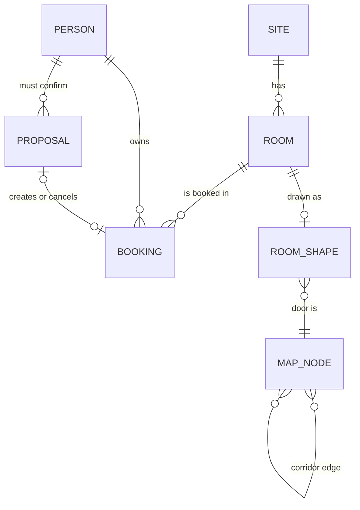
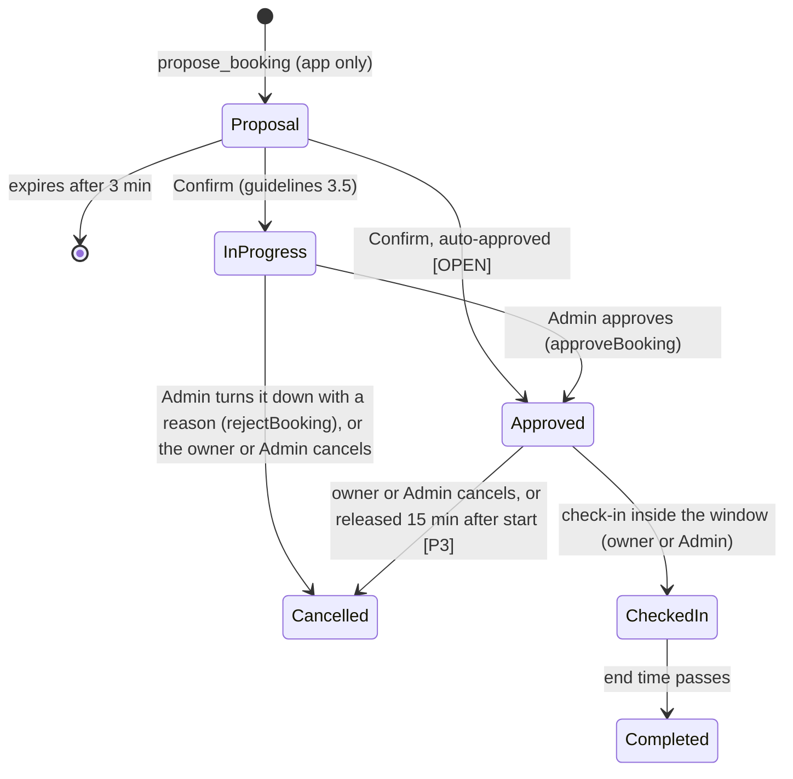

# 03 · Data model

Types live in `src/domain/types.ts` [Built]. Times are stored as UTC `Date` values and shown in Asia/Manila (UTC+8, no daylight saving). Intervals are half-open `[start, end)`, so a 3:00–4:00 PM booking and a 4:00–5:00 PM booking don't clash.

Exact data (every room with every field, the demo scenario verbatim, the random scenario, the mock gateway's behaviour, hardware options and hand-offs) is in **appendix A** (`appendix/A-data.md`). Every domain and service function (rules, availability, ranking, swaps, recurrence, search, proposals, views) with its exact behaviour and messages is in **appendix B** (`appendix/B-domain.md`).

## Entity overview


Owned by the **Room Reservation Tool** (read and written only through `ReservationGateway`): Room, Booking.
Owned by **this app**: Proposal, map data (07), the app store `src/store/` (sign-in accounts seeded from `src/config/accounts.ts`, the audit log, message threads; in memory, see App-owned data below), user settings [P2]. The tool's employee list comes from the gateway (`listPeople`; used by `scripts/ask.ts` and the evals).

## Enumerations
| Name | Values | Source |
|---|---|---|
| `Site` | `Manila`, `Iloilo` | Form "Location" |
| `AgendaType` | `Meeting`, `Training`, `Pantry`, `Lactation Room`, `Multi-purpose` | Form "Type of Agenda" |
| `RoomKind` | `Meeting`, `Collaboration`, `Huddle`, `Training`, `Multi-purpose`, `Pantry`, `Lactation Room`, `Visitor Office` | Guidelines p.8 room list |
| `AV` | `VC`, `BYOD`, `null` | Guidelines p.8 |
| `BookingStatus` | `Held`, `In Progress`, `Approved`, `Checked-In`, `Completed`, `Cancelled` | Tool statuses (+ `Held`, app only) |
| `Priority` | `Normal`, `Urgent` | Form "Priority" (`Priority` in `types.ts`) |
| `TrainingType` | `On-Site`, `Virtual` | Form "Type of Training" (`TrainingType` in `types.ts`) |

Which room kinds suit each type of agenda (`ROOM_KINDS_FOR`, `src/domain/ranking.ts`):

| Type of agenda | Room kinds |
|---|---|
| Meeting | Meeting, Collaboration, Huddle |
| Training | Training |
| Multi-purpose | Multi-purpose |
| Pantry | Pantry (no rooms listed yet) |
| Lactation Room | Lactation Room (`lactation-3f`, the "LAC. RM" on the 3F layout) |

## Room
| Field | Type | Req. | Description | Example |
|---|---|---|---|---|
| `id` | string | yes | Stable app id, lowercase, no spaces | `batanes` |
| `name` | string | yes | Display name | `Batanes` |
| `toolName` | string | no | Name as the tool shows it, when different; used to map tool data to `id` | `Batanes 3F` |
| `site` | Site | yes | | `Manila` |
| `building` | string | yes | | `Bldg. H` |
| `floor` | string | yes | | `3F` |
| `kind` | RoomKind | yes | | `Meeting` |
| `av` | AV | yes | Equipment | `BYOD` |
| `capacity` | number \| null | yes | Maximum people. `null` = unknown, never `0`. The tool shows ranges like "0–5"; store the maximum. | `6` |
| `selfBookable` | boolean | yes | `false` = Admin only (visitor offices) | `true` |
| `notes` | string | no | Data caveats | |
| `photoUrl` | string | no [P3] | Room photo for result cards | |

## Booking
A reservation as the Room Reservation Tool keeps it (`Booking` in `src/domain/types.ts`). Field names follow the tool's list view and form; the mapping is at the end of this section.

| Field | Type | Req. | Description | Example |
|---|---|---|---|---|
| `ticketNo` | string | yes | Tool ticket, `RM-` + 7 digits | `RM-0129908` |
| `roomId` | string | yes | `Room.id` | `centralpark` |
| `start`, `end` | Date | yes | `end` exclusive; may cross midnight | Mon 3:00 PM, 4:30 PM |
| `status` | BookingStatus | yes | | `Approved` |
| `agenda` | string | yes | Specific title | `Team sync` |
| `agendaType` | AgendaType | yes | The tool's list calls it **Category** | `Meeting` |
| `participants` | integer ≥ 1 | yes | | `4` |
| `owner` | Person | yes | Requester; the list calls it **Employee** | Tester, Alpha |
| `priority` | Priority | no | `Normal` unless the requester chose Urgent (allowed only per `urgentAllowed`). The mock fills `Normal` | `Normal` |
| `trainingType` | TrainingType | no | Training bookings only (`prepareBooking` drops it for other types; default On-Site). The app's form shows the field only when Type of agenda is Training; the tool's form shows it for every type (RULES open question 9) | `On-Site` |
| `specialInstructions` | string ≤ 500 | no | Free text for Admin | `U-shape seating` |
| `hardwareRequirements` | string[] | no | Form **Hardware Requirements**; values from `HARDWARE_OPTIONS` (`src/config/hardware.ts`, placeholders [OPEN]). The form sends at most one | `["Projector"]` |
| `createdBy` | string | no | Tool login of whoever filed it (**Created By**). The tool fills it; the mock uses the upper-case e-mail name | `MARKJOSEPH.REMETIO` |
| `createdAt` | Date | no | **Created Date**. The tool fills it; the mock sets it for bookings made in the app | |
| `modifiedBy` | string | no | **Modified By**, set by the tool | |
| `adminComments` | string | no | **Admin Comments**, set by Admin in the tool | |
| `recurrence` | Recurrence | no | The series this booking belongs to (form **Recurrence**, Guidelines 3.6); see Recurrence below. Every date of a series is its own booking with its own ticket | Weekly on Wednesday until Oct 28 |
| `holdExpiresAt` | Date | no | Only for `Held` | |
| `releasedAt` | Date | no | When the app cancelled it because nobody checked in (02 F34): a no-show | |

## Recurrence [Built]
`src/domain/recurrence.ts`, the tool form's Recurrence (Guidelines 3.6, p.6–7). Tests: `recurrence.test.ts`.
```ts
type Recurrence =
  | { freq: 'Daily'; every: number; until: Date }
  | { freq: 'Weekly'; every: number; days: Weekday[]; until: Date }            // Sunday … Saturday
  | { freq: 'Monthly'; every: number; on: { day: number } | { week: WeekOfMonth; weekday: Weekday }; until: Date } // First … Last
  | { freq: 'Yearly'; every: number; until: Date };
```
- `until` is the series' last date (the tool's **Ends at** date when Recurrence is ticked). Every date keeps the first date's Manila start time and length; a night booking may end the next morning.
- `expandRecurrence(first, rec, max = 100)` lists the dates in Manila calendar terms (a monthly "day 31" skips short months; "Last Friday" is the last one in the month). `describeRecurrence(rec)` gives text like "Weekly on Wednesday until Oct 28, 2026".
- JSON form (`RecurrenceJson`, API bodies and views): the same with `until` as an ISO string (`toRecurrenceJson`, `fromRecurrenceJson`).
- Limits: at most `RULES.maxSeriesDates` (100) dates; with `RULES.windowAppliesToEveryDate` [OPEN] every date must be inside the booking window.
- A series is booked **all or none**: `prepareBooking` checks every date's rules and availability (problems like "Tue, Oct 6: taken by Tester, Alpha"), and `createBooking` books every date or throws `ConflictError`.
- The tool ticks Daily by itself when Ends at is a later day; the app lets the user pick the pattern.

## RoomRequest and other domain types
- `Interval = { start: Date; end: Date }` (end exclusive).
- `RoomRequest = Interval & { site: Site; agendaType: AgendaType; participants: number; agenda?: string; needsVC?: boolean }`: what a search or booking asks for (`validateRequest`, `scoreRoom`, `searchRooms`).
- `Availability`, `Scored`/`Fit`, `RoomMatch`, `SearchResult`/`Flow`, `Issue`/`IssueCode`/`FormField`, `BookingDraft`, `Prepared`: appendix B.

## NewBooking (write request)
What the app sends to `ReservationGateway.createBooking` (`src/gateway/ReservationGateway.ts`): `roomId`, `start`, `end`, `agenda`, `agendaType`, `participants`, `requester: Person`, `priority?`, `trainingType?`, `specialInstructions?`, `hardwareRequirements?`, `recurrence?`. The tool assigns `ticketNo`, `status`, `createdBy`, `createdAt`. With a recurrence the gateway books every date (one ticket per date) or none, and returns the first date's booking. Built by `prepareBooking` from the form fields (06, BookingFields) or the `propose_booking` tool (05).

## Person and Requestor
| Field | Type | Req. | Description | Example |
|---|---|---|---|---|
| `name` | string | yes | "Last, First", like the tool | `Remetio, Mark Joseph` |
| `email` | string | for the requestor | Identity key; compared case-insensitively with `sameEmail` (`src/domain/people.ts`). Never sent to the browser | `markjoseph.remetio@example.com` |
| `division` | string | no | Shown with bookings | `Sales` |

`Requestor = Person & { email, login }` (`src/gateway/ReservationGateway.ts`): the **Name of Requestor** the app acts for. `login` is the tool's user name; the mock uses the upper-case e-mail name (`MARKJOSEPH.REMETIO`). In the app it is always the **signed-in account** (`requestor()`, 04 Session); `gateway.listPeople()` is the tool's employee list (default first), used by the scripts.

## Account (demo sign-in) [Built]
`Account = Person & { email, login, passwordHash }` (`src/config/accounts.ts`). Three accounts, added at the owner's request on 28 Sep 2026, until company sign-in (P3-02):

| Login | Name | E-mail | Division |
|---|---|---|---|
| `MARKJOSEPH.REMETIO` | Remetio, Mark Joseph | `markjoseph.remetio@example.com` | Sales |
| `JEREMIAH.SANDOVAL` | Sandoval, Jeremiah | `jeremiah.sandoval@example.com` | – |
| `LILI.LAGUNOY` | Lagunoy, Lili | `lili.lagunoy@example.com` | – |

`passwordHash` is `scrypt$<salt>$<hash>` (base64url, 16-byte salt, 32-byte key, `src/lib/passwords.ts`); passwords are never stored or logged. Name, e-mail and division match the person in the demo employee list, and the login is the upper-case e-mail name (routes test). The session cookie carries only the login and an expiry (04 Session).

## Proposal (app) [Built]
In memory in Phase 1 (`src/agent/proposals.ts`); in the database from Phase 3.

| Field | Type | Description |
|---|---|---|
| `id` | UUID | Card id, used in `POST /api/proposals/{id}` |
| `kind` | `book` \| `cancel` | |
| `userEmail` | string | Only this user can confirm |
| `booking` | NewBooking | For `book` (includes priority, training type, special instructions, hardware and recurrence) |
| `ticketNo` | string | For `cancel` |
| `expiresAt` | Date | Created + 3 minutes (`RULES.proposalHoldMinutes`) for the app's cards; + 15 minutes (`RULES.linkProposalHoldMinutes`) when an AI app prepared it over MCP |
| `view` | `{ kind: 'book', proposal: ProposalView }` \| `{ kind: 'cancel', cancel: CancelView }` | The card it shows, stored by `prepareBooking` / `prepareCancellation`, so a confirm link (`/?confirm=<id>`, `GET /api/proposals/{id}`) can open it again for the same person |

Proposals are single-use: taking one removes it; looking at one through a confirm link (`peekProposal`) doesn't. A proposal is not a hold in the tool; `POST /api/proposals/{id}` re-checks availability and the gateway returns a conflict if someone got there first.

## View models (JSON the browser sees)
Built on the server so the model, the map, the 3D view, the table and the cards all see the same data. Times are ISO UTC strings.

| View | Fields | Built by | Used by |
|---|---|---|---|
| `RoomView` | `id, name, toolName?, site, building, floor, kind, av, capacity, selfBookable` | `roomView()` in `src/services/views.ts` | `GET /api/rooms`; every UI surface |
| `PublicBooking` | `ticketNo, roomId, start, end, status, owner` (name), `division, participants, mine`; if `mine`: `agenda, agendaType, priority, trainingType, specialInstructions, hardwareRequirements, recurrence` (RecurrenceJson), `createdBy, createdAt, modifiedBy, adminComments` | `publicBooking(b, viewerEmail)` — **the privacy filter**; the viewer is the signed-in person | availability, bookings (list and mine), confirm, check-in, the schedule card |
| `RoomResultView` | `roomId, name, floor, availability` (`available`\|`partial`\|`unavailable`), `rank?, reasons[], free?[], conflicts?[]` (ticketNo, start, end, owner, division, participants, status) | `searchResultViews()` | `room_results` event and `POST /api/search` |
| `ScheduleView` | `start, end, rooms[]` (`roomId, name, floor, bookings` (PublicBooking[]), `free[]` ({start, end})), `more` (booked rooms left out), `freeRooms[]` (`roomId, name, floor`) | `scheduleView()` from `roomSchedule()` | `room_schedule` event (schedule card) |
| `AlternativeView` | `roomId, name, floor, start, end` | `searchResultViews()` | same |
| `ProposalView` | `id, requester, roomId, roomName, floor, start, end, agendaType, agenda, participants, priority, trainingType?, specialInstructions?, hardwareRequirements?, recurrence?` (RecurrenceJson), `dates?` (ISO start of every date in the series), `expiresAt` | `prepareBooking()` | `proposal` event, `POST /api/proposals` |
| `CancelView` | `proposalId, ticketNo, summary, expiresAt` | `prepareCancellation()` | `cancel_request` event, `POST /api/proposals` (cancel) |

In the browser, `reservedBy(status)` (`src/ui/roomStates.ts`) turns the bookings that overlap the selected time into who holds a room: short `Tester, A.` (+N when several) and full `Tester, Alpha (Operations)`; your own show as `You`. The signed-in person comes from `GET /api/session` as `{ login, name, division, role, mustChangePassword }` (no e-mail).

## Status lifecycle

A submitted reservation is **In Progress** until Admin approves it (guidelines 3.5); the mock creates every booking as In Progress, and Admin approves or turns it down at `/admin` (02 F30). Admin changes (`updateBooking`, `swapRooms`) keep the status and set `modifiedBy`; approve, turn down and an Admin cancel also set `adminComments` when a comment is given. A booking nobody checked in to by start + 15 min becomes Cancelled with `releasedAt` (`releaseNoShows`, run first by every API route; 02 F34, `RULES.autoReleaseNoShows`). Completed is only set by the tool. Which bookings are approved straight away is RULES open question 2. `In Progress`, `Approved` and `Checked-In` block the room. `Held` blocks until `holdExpiresAt`. `Cancelled` and `Completed` don't (`isBlocking`).

## Invariants (enforced in code and tests)
| # | Rule | Where |
|---|---|---|
| I1 | No two blocking bookings overlap in the same room | `conflictsFor`, `MockGateway.createBooking`, `parseScenario` |
| I1b | One person never holds two rooms at overlapping times (new bookings; `RULES.oneRoomPerPersonAtATime`) | `ownConflicts`, `prepareBooking` (`ownBookingClashes`), `MockGateway.createBooking` (`ConflictError` kind `requester`), routes and gateway tests |
| I2 | `end` after `start`; participants a whole number ≥ 1 | `validateRequest`, `parseScenario` |
| I3 | Agenda is specific when booking | `checkAgendaTitle` |
| I4 | Only the owner can cancel or check in; Admin (an actor with `role: 'admin'`, set only by `requireAdmin`) can also approve, turn down, change, swap and edit rooms | `MockGateway` (`assertOwner`, `assertAdmin`), admin routes test |
| I4b | An Admin change keeps the booking free of clashes: its room is free then and, when the time moves, its owner holds no other room | `prepareAdminChange`, `prepareAdminSwap`, `MockGateway.updateBooking`, `swapRooms` |
| I5 | Capacity is `null` when unknown, never guessed | `src/data/rooms.ts`, data test |
| I6 | Visitor offices are never self-bookable | data test |
| I7 | Every self-bookable Manila room has a map shape; every placed one (all but the four `unplaced`) is reachable from both lift lobbies | routing test |
| I8 | Other people's bookings never carry agenda, category, priority, training type, notes, hardware, recurrence, created/modified by, admin comments or email | `publicBooking`, routes test |
| I9 | Urgent priority only when `urgentAllowed` | `validateRequest` (`URGENT_NOT_ALLOWED`), rules and routes tests |
| I10 | Every room in the floor data gets walls with a door opening and never more seats than its capacity in the 3D model | `src/ui/building3d/layout.ts`, `layout3d.test.ts` |
| I11 | A repeating booking is all or none: every date passes the rules and is free, or nothing is booked | `prepareBooking`, `MockGateway.createBooking`, routes test |
| I12 | Every API route except health and session needs a signed-in account; identity comes only from the signed session cookie | `requireRequestor`, `readSession`, routes test |

## Mapping to the Room Reservation Tool
From the tool's reservation list and its **New Reservation** form (screens seen September 2026). The app keeps the same fields so the real gateway (08) is a straight mapping.

### List view columns
| Tool column | App field | Shown in the app |
|---|---|---|
| Ticket No | `ticketNo` | Table › Bookings (first column), cards, My bookings |
| Agenda | `agenda` | Your own bookings only (privacy rule 5; the tool shows everyone's — RULES open question 7). Without a chosen name, nothing is "yours" |
| Employee | `owner.name` | Everywhere a booking shows (map owner line, 3D label, timeline, table, cards) |
| Division | `owner.division` | Table, room sheet, cards |
| Category | `agendaType` | Your own bookings only (same privacy rule) |
| Building | `Room.building` | Table › Bookings |
| Room | `roomId` → `Room.name` (tool name via `toolName`, e.g. "Intramuros 3F", "Huddle Room 7 - 3F") | Everywhere |
| Starts At, Ends At | `start`, `end` | Table › Bookings (tool format `2026-09-28 10:30 PM`), cards, timeline |
| Created By | `createdBy` | Your own bookings (Table › Bookings, My bookings, booking details, CSV) |
| Created Date | `createdAt` | Your own bookings (same places), as `2026-09-26` |
| Status | `status` | Everywhere; words in 06 Copy |

### Form fields
The tool's reservation form, and what the app's form (`BookingFields`, used by the room sheet and New booking) does with each field. The app's form shows only what the user decides; the tool's read-only fields appear in Booking details (06). Exact markup: appendix I (`src/ui/BookingFields.tsx`, `src/ui/TimeFields.tsx`).

| Tool form field | App field | App behavior |
|---|---|---|
| Ticket # | `ticketNo` | Not in the app's form (the tool assigns it on submit). Shown on cards, My bookings and Booking details |
| Name of Requestor | `owner` = the signed-in person | Read-only (`RequestorLine` in `BookingFields`): the label "Name of requestor" and the name in a grey box. The server takes the person from the session (`requireRequestor`), never from the body. No name picker, no booking for someone else |
| Division | `owner.division` | Not a separate field: one line under the name, "Division: <division>", when the account has one |
| Agenda (required) | `agenda` | Placeholder "Specific title, e.g. Q4 pipeline review"; no hint line. Generic titles are rejected (`checkAgendaTitle`); the message appears only on submit (06, Form errors) |
| Type of Agenda (Meeting, Training, Pantry, Lactation Room, Multi-purpose) | `agendaType` | All five as radios. In the room sheet, types that don't suit the room are disabled. No "Book up to N days ahead" hint: a date too far ahead is reported on submit (`TOO_FAR_AHEAD`, `RULES.maxDaysAhead`). The tool's form note says Meeting, Training and MPH rooms can be booked up to 90 days ahead (RULES open question 1) |
| Priority (Urgent, Normal) | `priority` | Radios in the order Normal, Urgent; Normal by default. Urgent is disabled unless `urgentAllowed` says yes, with the hover hint "Urgent: training within two weeks, or a meeting within 24 hours". The tool's note says "a meeting within 12–24 business hours"; the code allows a Meeting that starts within the next 24 clock hours and a Training that starts within 14 days, never other types or a past start (RULES open question 4; enforced server-side as `URGENT_NOT_ALLOWED`) |
| Type of Training (On-Site, Virtual) | `trainingType` | Shown only when Type of agenda is Training (the tool shows it for every type); default On-Site; stored for Training only |
| Special Instructions | `specialInstructions` | "Special instructions (optional)", placeholder "Anything Admin should know", ≤ 500 |
| Number of Participants (required) | `participants` | Labelled "People"; required, 1–500 (the tool defaults to 0 and requires a value) |
| Hardware Requirements | `hardwareRequirements` | "Hardware (optional)": a select, "None" or one of `HARDWARE_OPTIONS` (placeholders [OPEN]); the form sends at most one. One line under it: "Also file it in ServiceNow · Room setup: Non-Solus" (links from `HANDOFFS.hardware` and `HANDOFFS.room_setup`) |
| Building | `Room.building` | Not in the app's form (only Bldg. H exists); shown in the table, CSV and Booking details |
| Room (required) | `roomId` | In New booking a select, "Best fit" (search) or the self-bookable rooms that suit the type ("<name> · <floor> · <capacity>"); not shown in the room sheet (the room is fixed); or chosen by the assistant |
| Starts at, Ends at (date + time, required) | `start`, `end` | A date and a 30-minute time each (06, TimeFields). With Repeat ticked, Ends at's date is the series' last date |
| Recurrence (checkbox) | `recurrence` | Labelled "Repeat": Daily / Weekly / Monthly / Yearly, "Every N day(s)/week(s)/…", weekday checkboxes with three-letter labels (Weekly), "Day D" or "The <First…Last> <weekday>" (Monthly), and the one help line "Ends at is the last date." |
| Status, Admin Comments, Modified By (read-only) | `status`, `adminComments`, `modifiedBy` | Not in the form; shown in Booking details for your own bookings when the tool sends them |
| Buttons: Submit / Cancel Reservation / Close | – | The app's Confirm booking / Cancel booking cards (02 F5, F8); nothing is written without them |

## Room master data
39 rooms, all in Bldg. H, Manila, in the order of `ROOMS` (`src/data/rooms.ts`). Source: guidelines p.8, p.10, p.11, the appendix layouts (p.12) and the tool's room list. Every field of every room, including the full `notes` text, is in appendix A1 (generated from `ROOMS`), and the file itself is verbatim in appendix I; this table only adds where each room is drawn and its demo capacity, so the notes are not repeated here. Iloilo rooms: not yet provided [OPEN].

**Real capacity** is what we know today (`null` = unknown until the tool's room data arrives). **Demo capacity** is used only by the demo scenario (`capacityOverrides` in `data/scenarios/demo.json`) and is not real data. **On map**: yes = traced from the layout; unplaced = bookable but not on the layout, drawn in a strip under 3F (07); no = not drawn (visitor offices, RULES open question 13).

| Floor | id | Name | Name in tool | Kind | AV | Real capacity | Demo capacity | Self-book | On map |
|---|---|---|---|---|---|---|---|---|---|
| 2F | `london` | London |  | Meeting | VC | 20 | (real) | yes | yes |
| 2F | `johannesburg` | Johannesburg |  | Meeting | VC | unknown | 6 | yes | yes |
| 2F | `saopaolo` | Sao Paolo |  | Meeting | VC | unknown | 6 | yes | yes |
| 2F | `newyork` | New York |  | Meeting | VC | unknown | 6 | yes | yes |
| 2F | `capetown` | Cape Town |  | Meeting | BYOD | 5 | (real) | yes | yes |
| 2F | `paris` | Paris |  | Meeting | VC | unknown | 6 | yes | yes |
| 2F | `amsterdam` | Amsterdam |  | Meeting | BYOD | 5 | (real) | yes | yes |
| 2F | `sydney` | Sydney |  | Meeting | BYOD | unknown | 4 | yes | yes |
| 2F | `tokyo` | Tokyo |  | Meeting | BYOD | unknown | 4 | yes | yes |
| 2F | `rio` | Rio De Janeiro |  | Meeting | BYOD | unknown | 4 | yes | yes |
| 2F | `hydepark` | Hyde Park |  | Collaboration | – | unknown | 10 | yes | yes |
| 2F | `centralpark` | Central Park |  | Collaboration | – | 10 | (real) | yes | yes |
| 2F | `snowdon` | Snowdon | Snowdon – TRA | Training | VC | unknown | 30 | yes | yes |
| 2F | `denali` | Denali | Denali – TRB | Training | VC | unknown | 30 | yes | yes |
| 2F | `mph1` | MPH 1 |  | Multi-purpose | – | unknown | 120 | yes | yes |
| 2F | `mph2` | MPH 2 |  | Multi-purpose | – | unknown | 120 | yes | yes |
| 2F | `office-2f-024` | Office 2F-024 |  | Visitor Office | – | unknown | – | Admin only | no |
| 2F | `office-2f-025` | Office 2F-025 |  | Visitor Office | – | unknown | – | Admin only | no |
| 2F | `office-2f-026` | Office 2F-026 |  | Visitor Office | – | unknown | – | Admin only | no |
| 2F | `office-2f-027` | Office 2F-027 |  | Visitor Office | – | unknown | – | Admin only | no |
| 3F | `mactan` | Mactan |  | Meeting | VC | unknown | 10 | yes | yes |
| 3F | `coron` | Coron |  | Meeting | VC | unknown | 6 | yes | yes |
| 3F | `siargao` | Siargao | Siargao 3F | Meeting | BYOD | unknown | 4 | yes | yes |
| 3F | `vigan` | Vigan |  | Meeting | BYOD | unknown | 4 | yes | yes |
| 3F | `binondo` | Binondo | Binondo 3F | Meeting | BYOD | 4 | (real) | yes | yes |
| 3F | `batanes` | Batanes | Batanes 3F | Meeting | BYOD | 6 | (real) | yes | yes |
| 3F | `jolo` | Jolo |  | Meeting | BYOD | unknown | 4 | yes | yes |
| 3F | `camiguin` | Camiguin |  | Meeting | BYOD | unknown | 4 | yes | yes |
| 3F | `intramuros` | Intramuros | Intramuros 3F | Meeting | – | unknown | 6 | yes | unplaced |
| 3F | `tagaytay` | Tagaytay |  | Collaboration | – | unknown | 12 | yes | yes |
| 3F | `tanay` | Tanay |  | Collaboration | – | unknown | 6 | yes | yes |
| 3F | `huddle6` | Huddle Room 6 |  | Huddle | – | unknown | 3 | yes | unplaced |
| 3F | `huddle7` | Huddle Room 7 | Huddle Room 7 - 3F | Huddle | – | unknown | 3 | yes | unplaced |
| 3F | `huddle8` | Huddle Room 8 |  | Huddle | – | unknown | 3 | yes | unplaced |
| 3F | `mtapo` | Mt. Apo |  | Training | VC | 20 | (real) | yes | yes |
| 3F | `mtmayon` | Mt. Mayon |  | Training | VC | 20 | (real) | yes | yes |
| 3F | `elnido` | El Nido |  | Training | VC | unknown | 20 | yes | yes |
| 3F | `bacolod` | Bacolod | Bacolod 3F | Meeting | – | unknown | 6 | yes | yes |
| 3F | `lactation-3f` | Lactation Room |  | Lactation Room | – | unknown | – | yes | yes |

## Demo scenario (`data/scenarios/demo.json`) [Built]
The file is reproduced verbatim in appendix A2, with the loader's checks and messages. A fixed week that reproduces the prototype. Load it with `MOCK_SCENARIO=demo` (default). With `DEMO_NOW=2026-09-28T09:00:00+08:00` the clock replays that week from Mon, Sep 28, 9:00 AM and the bookings stay on the dates below (the scripted demo, tests and evals). Without `DEMO_NOW` (the default since v0.10) the clock is the real time, shown in Asia/Manila, and `getGateway()` loads `scenarioInWeekOf(DEMO_SCENARIO, now())`: every booking (and the scenario's `now`) moves by whole weeks into the current Manila week (Monday 00:00, `manilaStartOfWeek`), same weekday and time, so the map is never empty; in the demo week itself nothing moves. `parseScenario` rejects unknown rooms, statuses, agenda types, owners, bad dates and overlaps. The JSON has no priority or created-by values; `MockGateway` fills `priority: Normal` and `createdBy` (upper-case e-mail name) the way the tool would. The employee list (`listPeople`) is `demoUser` followed by `people` (deduplicated by email); the demo user is the default in `scripts/ask.ts`, the evals and the routes tests. In the browser, the requestor is whoever signs in. The mock keeps everything in memory: restart the server to reset the week. `MOCK_SCENARIO=random` generates sample bookings instead (placeholder people, seeded, 7 days).

People: Remetio, Mark Joseph (Sales, the demo user; the project owner's own name, at their request) · Sandoval, Jeremiah and Lagunoy, Lili (no division; sign-in accounts added at the owner's request on 28 Sep 2026, no bookings in the demo week) · Tester, Alpha (Operations) · Tester, Bravo (HR) · Tester, Charlie (Learning) · Tester, Delta (Sales) · Tester, Echo (Technology). All emails are `@example.com` (e.g. `alpha.tester@example.com`). Never add any other real employee names.

| Ticket | Room | When | Owner | Agenda | Type | People | Status |
|---|---|---|---|---|---|---|---|
| RM-0129901 | Amsterdam, 2F | Mon, Sep 28, 9:30 AM – 10:30 AM | Tester, Alpha | Daily huddle | Meeting | 4 | Approved |
| RM-0129902 | Tokyo, 2F | Mon, Sep 28, 10:00 AM – 11:00 AM | Remetio, Mark Joseph | Weekly touchpoint meeting | Meeting | 4 | Approved |
| RM-0129903 | London, 2F | Mon, Sep 28, 1:00 PM – 5:00 PM | Tester, Delta | Client workshop | Meeting | 14 | Approved |
| RM-0129904 | Mactan, 3F | Mon, Sep 28, 1:30 PM – 3:30 PM | Tester, Bravo | Panel interviews | Meeting | 5 | Approved |
| RM-0129905 | Hyde Park, 2F | Mon, Sep 28, 2:00 PM – 4:00 PM | Tester, Echo | Sprint review | Meeting | 9 | Approved |
| RM-0129906 | Tagaytay, 3F | Mon, Sep 28, 2:00 PM – 5:00 PM | Tester, Charlie | Coaching circle | Meeting | 10 | In Progress |
| RM-0129907 | New York, 2F | Mon, Sep 28, 2:30 PM – 3:30 PM | Tester, Echo | Vendor call | Meeting | 3 | Approved |
| RM-0129908 | Central Park, 2F | Mon, Sep 28, 3:00 PM – 4:30 PM | Tester, Alpha | Team sync | Meeting | 4 | Approved |
| RM-0129909 | Paris, 2F | Mon, Sep 28, 3:00 PM – 4:00 PM | Tester, Delta | Client call prep | Meeting | 4 | Approved |
| RM-0129910 | Snowdon, 2F | Mon, Sep 28, 10:00 PM – Tue, Sep 29, 2:00 AM | Tester, Charlie | Night shift onboarding | Training | 18 | Approved |
| RM-0129911 | Cape Town, 2F | Mon, Sep 28, 11:00 AM – 12:00 PM | Tester, Bravo | Benefits Q&A | Meeting | 5 | Cancelled |
| RM-0129912 | Batanes, 3F | Tue, Sep 29, 2:00 PM – 3:00 PM | Remetio, Mark Joseph | Client call prep | Meeting | 5 | Approved |
| RM-0129913 | MPH 1, 2F | Fri, Oct 2, 12:00 PM – 6:00 PM | Tester, Bravo | Q4 town hall | Multi-purpose | 80 | Approved |
| RM-0129914 | MPH 2, 2F | Fri, Oct 2, 1:00 PM – 5:00 PM | Tester, Charlie | New hire training | Training | 24 | Approved |
| RM-0129915 | Mt. Mayon, 3F | Fri, Oct 2, 1:00 PM – 5:00 PM | Tester, Echo | Product training | Training | 22 | Approved |

What each booking is for (dates as in the demo week):
- **Flow A** (5 people, Mon 3–4 PM): Paris, Central Park and Hyde Park are taken; New York and Mactan are partly free; right-size rooms stay free, and Amsterdam, Bacolod and Batanes rank 1–3.
- **Flow B** (8 people, Mon 2–4 PM): only five rooms seat 8 or more; London, Hyde Park and Tagaytay are taken, Central Park and Mactan are partly free.
- **Flow C** (60 people, Fri 1–5 PM): both halls taken. Swap options for Charlie's 24-person training: Denali and Snowdon on 2F (Mt. Mayon is taken and Mt. Apo seats 20).
- **My bookings and check-in**: Mark Joseph's Tokyo booking at 10:00 AM is inside its check-in window at 9:00 AM.
- **Edge cases**: a cancelled booking that doesn't block (Cape Town), an In Progress booking that does (Tagaytay), a night-shift training across midnight (Snowdon).

## App-owned data (Admin, P1-39)
`AppStore` (`src/store/AppStore.ts`), today `MemoryStore` (in memory, one per server; a restart starts again from the configured accounts, like the demo bookings). Reservations are never stored here: they go through `ReservationGateway`.
| Part | Record | Notes |
|---|---|---|
| `accounts` | `StoredAccount` = `Account` (`login`, `name`, `email`, `division?`, `role`, `passwordHash`) + `disabled`, `mustChangePassword`, `sessionsValidAfter` (wall-clock ms: sessions and AI-app tokens issued at or before it are refused), `createdAt`, `lastSignInAt?` | seeded from `ACCOUNTS`; `find(username)` by login or e-mail, any case; `create` refuses a login or e-mail already used |
| `audit` | `AuditEntry` = `id`, `at`, `actor` (login, or the username tried), `actorName`, `action`, `target?` (ticket, login or room id), `detail?` (a short summary) | append-only; the last `AUDIT_LIMIT` = 5 000; `list()` newest first. Actions: `session.signin`, `session.signin_failed`, `session.signout`, `session.password`, `booking.create`, `booking.cancel`, `booking.checkin`, `booking.release` (actor `SYSTEM`, "REPH Rooms"), `booking.approve`, `booking.reject`, `booking.update`, `booking.swap`, `user.create`, `user.update`, `user.reset`, `user.signout`, `room.update`, `message.send` |
| `messages` | `Thread` = `ticketNo`, `ownerEmail`, `ownerName`, `messages[]`; `Message` = `id`, `ticketNo`, `at`, `login`, `name`, `admin`, `system?`, `text` | one thread per booking, made by its first message; read markers per login and ticket (`lastRead`, `markRead`) |

Room details changed by Admin (`updateRoom`: name, capacity, AV, self-service, notes) live in the gateway's room list (the mock's copy of `ROOMS`) until the tool's room data is connected [OPEN: RULES question 19].

## App-owned tables [P3]
PostgreSQL (P3-06: a `PostgresStore` for `AppStore` and the proposals). Reservations are not stored here.
```sql
create table proposals (
  id uuid primary key,
  kind text not null check (kind in ('book','cancel')),
  user_email text not null,
  payload jsonb not null,
  expires_at timestamptz not null,
  taken_at timestamptz
);
create index on proposals (expires_at) where taken_at is null;

-- MCP (05): connected AI apps, so a person can see and revoke them, and one-time ids shared by every instance.
create table mcp_grants (
  id uuid primary key,
  user_email text not null,
  client_name text not null,
  client_fingerprint text not null,
  created_at timestamptz not null default now(),
  last_used_at timestamptz,
  revoked_at timestamptz
);
create table oauth_used_ids (   -- used codes and rotated refresh tokens (replaces the in-memory set)
  jti text primary key,
  expires_at timestamptz not null
);

create table accounts (          -- until company sign-in (P3-02) replaces passwords
  login text primary key,
  name text not null,
  email text not null unique,
  division text,
  role text not null check (role in ('admin','user')),
  password_hash text not null,
  disabled boolean not null default false,
  must_change_password boolean not null default false,
  sessions_valid_after timestamptz,
  created_at timestamptz not null default now(),
  last_sign_in_at timestamptz
);

create table audit_log (
  id bigserial primary key,
  at timestamptz not null default now(),
  actor text not null,           -- login (or the username tried)
  actor_name text not null,
  action text not null,          -- the AuditAction values above
  target text,                   -- ticket, login or room id
  detail text
);

create table messages (
  id bigserial primary key,
  ticket_no text not null,
  owner_email text not null,
  at timestamptz not null default now(),
  login text not null,
  name text not null,
  admin boolean not null,
  system boolean not null default false,
  text text not null check (length(text) between 1 and 2000)
);
create index on messages (ticket_no, at);
create table message_reads (
  login text not null,
  ticket_no text not null,
  read_at timestamptz not null,
  primary key (login, ticket_no)
);

create table user_settings (
  user_email text primary key,
  home_site text not null default 'Manila',
  start_node text,               -- map node id of their desk or usual lobby
  avoid_stairs boolean not null default false
);
```
